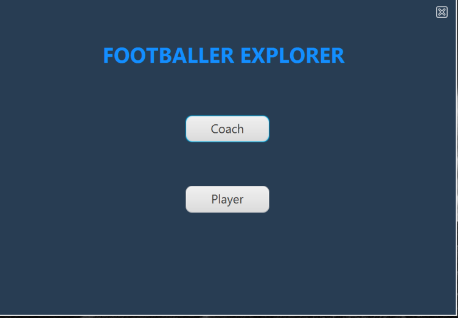
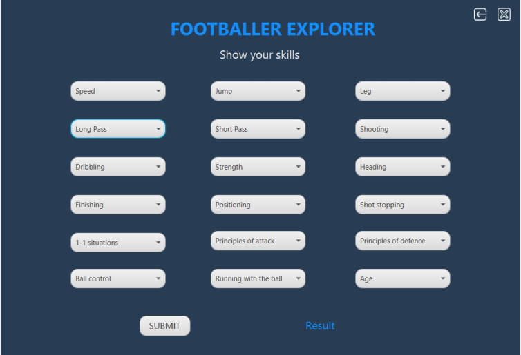
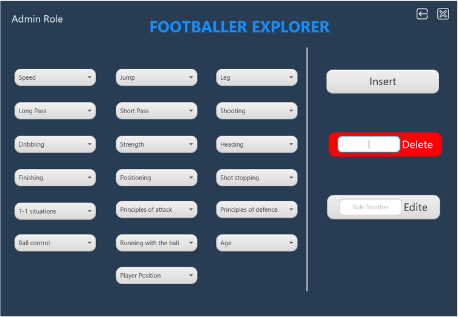

# Footballer Explorer
Desktop Application that helps the player to identify his position in the field, also helps the coach to manage that system (add-delete-update) using KBS

## Built With

* [JavaFx]
* [Jess]

## Authors

* [Muhammad Ramadan](https://www.linkedin.com/in/m7mdramadandx/)

## Screenshots for the App

